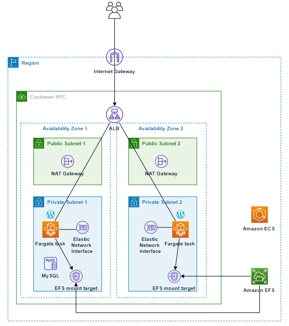

# WordPress on Amazon ECS on AWS Fargate
## This architecture contain
- _All ECS Components (ECS Cluster, ECS Service, ECS Task Definition)_
- _Wordpress was deployed on ECS Fargate type_
- _Fargate is using EFS for a storage_
- _There are all networking requirements (VPC, Private, Public, Database subnets)_
- _RDS Aurora MySQL Cluster for wordpress database_




I preferred to create my own modules because the use of Public modules depends on the specific version of the child modules. But for the network part, which includes Public, Private, Database Subnets with Route tables configured, I use Public to show that I can work with them too. And for production, it is better to use images from the company registry (in your case ECR).

```bash
export AWS_ACCESS_KEY_ID=<write your access key id>
export AWS_SECRET_ACCESS_KEY=<write you secret access key>
export AWS_DEFAULT_REGION=<write default region to create resource in>
```

Then perform the following commands on the root folder:
- `terraform init` terraform initialization
- `terraform plan` to see the infrastructure plan
- `terraform apply` to apply infrastructure build
- `terraform destroy` to destroy the infrastructure


## Requirements

| Name | Version |
|------|---------|
| <a name="requirement_terraform"></a> [terraform](#requirement\_terraform) | 1.3.7 |
| <a name="requirement_aws"></a> [aws](#requirement\_aws) | 4.53.0 |
| <a name="requirement_random"></a> [random](#requirement\_random) | 3.4.3 |

## Providers

| Name | Version |
|------|---------|
| <a name="provider_aws"></a> [aws](#provider\_aws) | 4.53.0 |
| <a name="provider_random"></a> [random](#provider\_random) | 3.4.3 |

## Modules

| Name | Source | Version |
|------|--------|---------|
| <a name="module_alb"></a> [alb](#module\_alb) | ../../modules/alb | n/a |
| <a name="module_ecs"></a> [ecs](#module\_ecs) | ../../modules/ecs | n/a |
| <a name="module_rds"></a> [rds](#module\_rds) | ../../modules/rds | n/a |
| <a name="module_vpc"></a> [vpc](#module\_vpc) | terraform-aws-modules/vpc/aws | n/a |

## Resources

| Name | Type |
|------|------|
| [aws_cloudwatch_log_group.wordpress](https://registry.terraform.io/providers/hashicorp/aws/4.53.0/docs/resources/cloudwatch_log_group) | resource |
| [aws_kms_alias.wordpress](https://registry.terraform.io/providers/hashicorp/aws/4.53.0/docs/resources/kms_alias) | resource |
| [aws_kms_key.wordpress](https://registry.terraform.io/providers/hashicorp/aws/4.53.0/docs/resources/kms_key) | resource |
| [aws_secretsmanager_secret.wordpress](https://registry.terraform.io/providers/hashicorp/aws/4.53.0/docs/resources/secretsmanager_secret) | resource |
| [aws_secretsmanager_secret_version.wordpress](https://registry.terraform.io/providers/hashicorp/aws/4.53.0/docs/resources/secretsmanager_secret_version) | resource |
| [aws_security_group.ecs_service](https://registry.terraform.io/providers/hashicorp/aws/4.53.0/docs/resources/security_group) | resource |
| [aws_security_group.efs_service](https://registry.terraform.io/providers/hashicorp/aws/4.53.0/docs/resources/security_group) | resource |
| [aws_security_group.lb_service](https://registry.terraform.io/providers/hashicorp/aws/4.53.0/docs/resources/security_group) | resource |
| [aws_security_group.rds_cluster](https://registry.terraform.io/providers/hashicorp/aws/4.53.0/docs/resources/security_group) | resource |
| [aws_security_group_rule.ecs_service_egress_efs_tcp](https://registry.terraform.io/providers/hashicorp/aws/4.53.0/docs/resources/security_group_rule) | resource |
| [aws_security_group_rule.ecs_service_egress_http](https://registry.terraform.io/providers/hashicorp/aws/4.53.0/docs/resources/security_group_rule) | resource |
| [aws_security_group_rule.ecs_service_egress_https](https://registry.terraform.io/providers/hashicorp/aws/4.53.0/docs/resources/security_group_rule) | resource |
| [aws_security_group_rule.ecs_service_egress_mysql](https://registry.terraform.io/providers/hashicorp/aws/4.53.0/docs/resources/security_group_rule) | resource |
| [aws_security_group_rule.ecs_service_ingress_http](https://registry.terraform.io/providers/hashicorp/aws/4.53.0/docs/resources/security_group_rule) | resource |
| [aws_security_group_rule.ecs_service_ingress_https](https://registry.terraform.io/providers/hashicorp/aws/4.53.0/docs/resources/security_group_rule) | resource |
| [aws_security_group_rule.efs_service_ingress_nfs_tcp](https://registry.terraform.io/providers/hashicorp/aws/4.53.0/docs/resources/security_group_rule) | resource |
| [aws_security_group_rule.lb_service_egress_http](https://registry.terraform.io/providers/hashicorp/aws/4.53.0/docs/resources/security_group_rule) | resource |
| [aws_security_group_rule.lb_service_egress_https](https://registry.terraform.io/providers/hashicorp/aws/4.53.0/docs/resources/security_group_rule) | resource |
| [aws_security_group_rule.lb_service_ingress_http](https://registry.terraform.io/providers/hashicorp/aws/4.53.0/docs/resources/security_group_rule) | resource |
| [aws_security_group_rule.lb_service_ingress_https](https://registry.terraform.io/providers/hashicorp/aws/4.53.0/docs/resources/security_group_rule) | resource |
| [aws_security_group_rule.rds_cluster_ingress_mysql](https://registry.terraform.io/providers/hashicorp/aws/4.53.0/docs/resources/security_group_rule) | resource |
| [random_password.db_password](https://registry.terraform.io/providers/hashicorp/random/3.4.3/docs/resources/password) | resource |
| [aws_caller_identity.current](https://registry.terraform.io/providers/hashicorp/aws/4.53.0/docs/data-sources/caller_identity) | data source |
| [aws_iam_policy_document.kms](https://registry.terraform.io/providers/hashicorp/aws/4.53.0/docs/data-sources/iam_policy_document) | data source |
| [aws_rds_engine_version.rds_engine_version](https://registry.terraform.io/providers/hashicorp/aws/4.53.0/docs/data-sources/rds_engine_version) | data source |
| [aws_region.current](https://registry.terraform.io/providers/hashicorp/aws/4.53.0/docs/data-sources/region) | data source |
| [aws_subnet.ecs_service_subnet_ids](https://registry.terraform.io/providers/hashicorp/aws/4.53.0/docs/data-sources/subnet) | data source |

## Outputs

| Name | Description |
|------|-------------|
| <a name="output_lb_dns"></a> [lb\_dns](#output\_lb\_dns) | Wordpress Load Balancer DNS |
